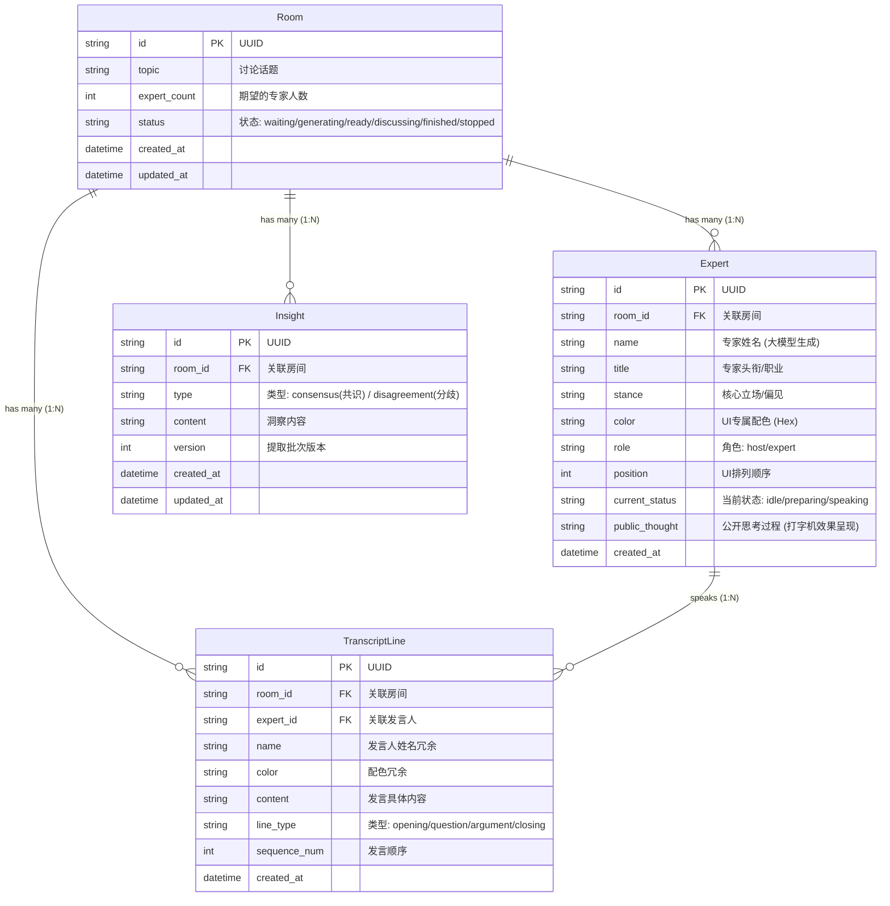

# AI Panel Studio - 数据库实体关系图 (ER Diagram)

本项目采用轻量级的 SQLite 作为核心数据存储，整体架构围绕“演播厅 (Room)”进行多表关联。

## Mermaid ER 图

## 设计说明
1. **反范式设计**：在 `TranscriptLine` 中冗余了 `name` 和 `color` 字段，以极大地提升 SSE 流式推送时的查询性能，避免了高频的多表 Join。
2. **状态流转追踪**：`Expert` 表中的 `current_status` 和 `public_thought` 支撑了前端演播厅的实时生命力表现。
