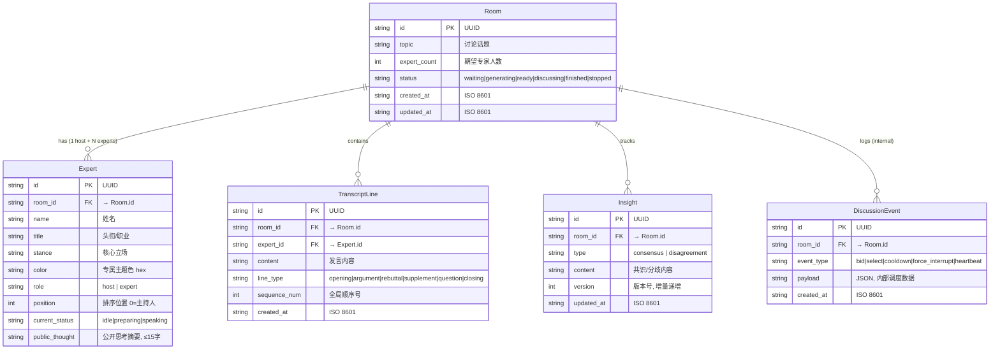
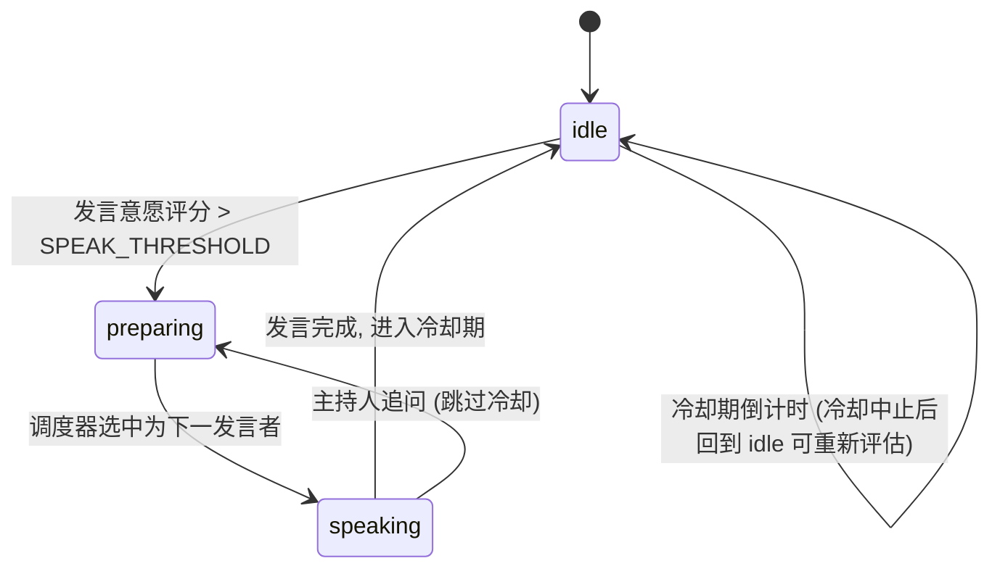
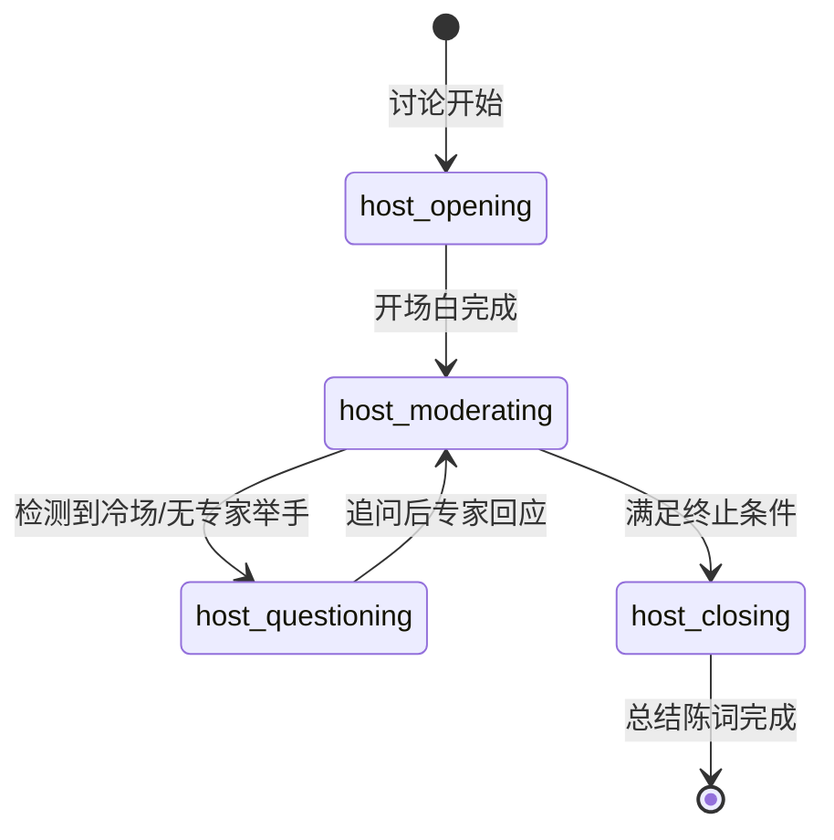

# Smart AI Panel — 系统设计说明书 (SDD)

> **版本**: v1.0  
> **最后更新**: 2026-06-26  
> **技术栈**: React 18 + Vite + TypeScript / Python FastAPI / SQLite / SSE  
> **LLM**: Deepseek V4 Pro  
> **引擎**: Claude Code + Superpowers 6.0.3  
> **状态**: A 阶段完成 — 待用户审查

---

## 目录

1. [系统架构 & 技术栈总览](#1-系统架构--技术栈总览)
2. [数据模型 & 数据库设计](#2-数据模型--数据库设计)
3. [API 接口契约 & SSE 事件协议](#3-api-接口契约--sse-事件协议) *(待撰写)*
4. [调度算法 & Agent 行为状态机](#4-调度算法--agent-行为状态机) *(待撰写)*
5. [前端架构 & 数据流规约](#5-前端架构--数据流规约) *(待撰写)*
6. [安全 & 降级策略](#6-安全--降级策略) *(待撰写)*

---

## 1. 系统架构 & 技术栈总览

### 1.1 架构分层图

```
┌─────────────────────────────────────────────────────────────────┐
│                        浏览器 (localhost:5173)                     │
│  ┌─────────┐ ┌──────────┐ ┌──────────┐ ┌────────────────────┐  │
│  │ HomePage │ │ LobbyPage│ │StudioPage│ │   Zustand Store    │  │
│  │ - 列表    │ │ - 阵容确认│ │ - 字幕    │ │   rooms / experts  │  │
│  │ - 新建    │ │ - 编辑    │ │ - 专家卡  │ │   transcript       │  │
│  │          │ │ - 确认    │ │ - 洞察    │ │   insights / ui    │  │
│  └────┬─────┘ └────┬─────┘ └────┬─────┘ └─────────┬──────────┘  │
│       │             │            │                  │             │
│       ▼             ▼            ▼                  │             │
│  ┌─────────────────────────────────────────────┐   │             │
│  │          API Client Layer (fetch)            │   │             │
│  │  /api/rooms  │  /api/rooms/:id/experts      │   │             │
│  │  /api/rooms/:id/start │ /api/rooms/:id/stream│   │             │
│  └──────────────────────┬──────────────────────┘   │             │
│                         │ REST (JSON)                │             │
│                         ▼                            │             │
│  ┌─────────────────────────────────────────────────┐ │             │
│  │            SSE Client (EventSource)              │─┘             │
│  │  onmessage → dispatch → Zustand Store update    │               │
│  └──────────────────────┬──────────────────────────┘               │
└─────────────────────────┼──────────────────────────────────────────┘
                          │ HTTP / SSE
┌─────────────────────────┼──────────────────────────────────────────┐
│                 FastAPI (localhost:3000)                            │
│                         │                                           │
│  ┌──────────────────────┼──────────────────────────────────────┐   │
│  │                   CORS Middleware                             │   │
│  └──────────────────────┼──────────────────────────────────────┘   │
│         ┌───────────────┼───────────────┐                          │
│         ▼               ▼               ▼                          │
│  ┌──────────┐  ┌──────────────┐  ┌──────────────┐                 │
│  │ REST API │  │  SSE Manager │  │  Scheduler   │                 │
│  │ /rooms   │  │  Per-room    │  │  评分函数    │                 │
│  │ /experts │  │  channels    │  │  举手调度    │                 │
│  │ /start   │  │  广播增量    │  │  终止检测    │                 │
│  └────┬─────┘  └──────┬───────┘  └──────┬───────┘                 │
│       │               │                  │                          │
│       ▼               ▼                  ▼                          │
│  ┌──────────────────────────────────────────────────────────┐      │
│  │                    Service Layer                          │      │
│  │  ┌─────────────┐ ┌───────────┐ ┌─────────────────────┐   │      │
│  │  │ LLM Client  │ │Insight    │ │ Expert Generator    │   │      │
│  │  │ (Deepseek)  │ │Extractor  │ │ (阵容生成 + 校验)    │   │      │
│  │  └─────────────┘ └───────────┘ └─────────────────────┘   │      │
│  └──────────────────────┬───────────────────────────────────┘      │
│                         ▼                                          │
│  ┌──────────────────────────────────────────────────────────┐      │
│  │              Data Access Layer (aiosqlite)                 │      │
│  │  ┌─────┐ ┌────────┐ ┌────────────────┐ ┌───────────┐    │      │
│  │  │Room │ │Expert  │ │TranscriptLine  │ │ Insight   │    │      │
│  │  │Repo │ │Repo    │ │Repo            │ │ Repo      │    │      │
│  │  └─────┘ └────────┘ └────────────────┘ └───────────┘    │      │
│  └──────────────────────┬───────────────────────────────────┘      │
│                         ▼                                          │
│                   ┌──────────┐                                     │
│                   │  SQLite  │                                     │
│                   │  (WAL)   │                                     │
│                   └──────────┘                                     │
└────────────────────────────────────────────────────────────────────┘
```

### 1.2 架构模式：「智能前端 + 哑流」分离式 (Hub-and-Spoke 改良)

**核心通信契约**:
- **REST API** → 历史数据 (CRUD)：创建房间、拉取列表、拉取完整 Transcript、获取专家阵容
- **SSE** → 实时增量广播 (Pub/Sub)：专家状态切换、新发言产生、共识/分歧更新、讨论终止
- **前端恢复流程**：断线重连 / 首次进入 → REST 拉全量历史 → 渲染完毕 → SSE 监听增量（"拉取历史 + 监听增量" 解耦模式）

### 1.3 技术栈确定

| 层 | 技术 | 版本 |
|----|------|------|
| 前端框架 | React + TypeScript | 18.x |
| 构建工具 | Vite | 5.x |
| CSS | Tailwind CSS | 3.x |
| 组件库 | shadcn/ui (Radix primitives) | latest |
| 状态管理 | Zustand | 4.x |
| API 客户端 | fetch (原生) | — |
| SSE 客户端 | EventSource (原生) | — |
| 后端框架 | FastAPI + uvicorn | 0.100+ |
| 数据验证 | Pydantic | v2 |
| 数据库驱动 | aiosqlite | 0.19+ |
| LLM SDK | openai (兼容 Deepseek) | 1.x |
| 测试 | pytest + pytest-asyncio + httpx | latest |

---

## 2. 数据模型 & 数据库设计

### 2.1 ER 图



### 2.2 完整 DDL

```sql
-- database/schema.sql
-- Smart AI Panel — 完整 DDL (SQLite)

PRAGMA journal_mode=WAL;
PRAGMA foreign_keys=ON;

CREATE TABLE rooms (
    id          TEXT PRIMARY KEY,
    topic       TEXT    NOT NULL,
    expert_count INTEGER NOT NULL DEFAULT 4,
    status      TEXT    NOT NULL DEFAULT 'waiting'
                CHECK(status IN ('waiting','generating','ready','discussing','finished','stopped')),
    created_at  TEXT    NOT NULL DEFAULT (datetime('now')),
    updated_at  TEXT    NOT NULL DEFAULT (datetime('now'))
);

CREATE TABLE experts (
    id              TEXT PRIMARY KEY,
    room_id         TEXT    NOT NULL REFERENCES rooms(id) ON DELETE CASCADE,
    name            TEXT    NOT NULL,
    title           TEXT    NOT NULL,
    stance          TEXT    NOT NULL,
    color           TEXT    NOT NULL,
    role            TEXT    NOT NULL CHECK(role IN ('host','expert')),
    position        INTEGER NOT NULL DEFAULT 0,
    current_status  TEXT    NOT NULL DEFAULT 'idle'
                    CHECK(current_status IN ('idle','preparing','speaking')),
    public_thought  TEXT    DEFAULT ''
);

CREATE INDEX idx_experts_room ON experts(room_id);

CREATE TABLE transcript_lines (
    id          TEXT PRIMARY KEY,
    room_id     TEXT    NOT NULL REFERENCES rooms(id) ON DELETE CASCADE,
    expert_id   TEXT    NOT NULL REFERENCES experts(id) ON DELETE CASCADE,
    content     TEXT    NOT NULL,
    line_type   TEXT    NOT NULL CHECK(line_type IN ('opening','argument','rebuttal','supplement','question','closing')),
    sequence_num INTEGER NOT NULL,
    created_at  TEXT    NOT NULL DEFAULT (datetime('now'))
);

CREATE INDEX idx_transcript_room ON transcript_lines(room_id);
CREATE INDEX idx_transcript_seq ON transcript_lines(room_id, sequence_num);

CREATE TABLE insights (
    id          TEXT PRIMARY KEY,
    room_id     TEXT    NOT NULL REFERENCES rooms(id) ON DELETE CASCADE,
    type        TEXT    NOT NULL CHECK(type IN ('consensus','disagreement')),
    content     TEXT    NOT NULL,
    version     INTEGER NOT NULL DEFAULT 1,
    updated_at  TEXT    NOT NULL DEFAULT (datetime('now'))
);

CREATE INDEX idx_insights_room ON insights(room_id);

CREATE TABLE discussion_events (
    id          TEXT PRIMARY KEY,
    room_id     TEXT    NOT NULL REFERENCES rooms(id) ON DELETE CASCADE,
    event_type  TEXT    NOT NULL,
    payload     TEXT    NOT NULL DEFAULT '{}',
    created_at  TEXT    NOT NULL DEFAULT (datetime('now'))
);

CREATE INDEX idx_events_room ON discussion_events(room_id);
```

### 2.3 Pydantic 领域模型

```python
# ───────────────────────────────────── backend/models/room.py ─────────────────────────────────────
from pydantic import BaseModel, Field
from typing import Optional, Literal
from datetime import datetime

RoomStatus = Literal["waiting", "generating", "ready", "discussing", "finished", "stopped"]

class RoomCreate(BaseModel):
    """POST /api/rooms Request"""
    topic: str = Field(..., min_length=1, max_length=200, description="讨论议题")
    expert_count: int = Field(default=4, ge=2, le=8, description="专家人数")

class RoomResponse(BaseModel):
    """GET /api/rooms Response Item"""
    id: str
    topic: str
    expert_count: int
    status: RoomStatus
    created_at: datetime
    updated_at: datetime

class RoomDetail(RoomResponse):
    """GET /api/rooms/{id} Response — 含完整阵容和统计"""
    experts: list["ExpertResponse"] = []
    transcript_count: int = 0
    insight_count: int = 0


# ───────────────────────────────────── backend/models/expert.py ─────────────────────────────────────
ExpertRole = Literal["host", "expert"]
ExpertStatus = Literal["idle", "preparing", "speaking"]

class ExpertResponse(BaseModel):
    """API 返回的专家信息 — 前端永远通过此模型消费"""
    id: str
    name: str
    title: str
    stance: str
    color: str
    role: ExpertRole
    position: int
    current_status: ExpertStatus = "idle"
    public_thought: str = ""

class LLMExpertRaw(BaseModel):
    """LLM 返回的专家原始数据 — Pydantic 严格反序列化防线"""
    name: str = Field(..., min_length=1, max_length=20)
    title: str = Field(..., min_length=1, max_length=50)
    stance: str = Field(..., min_length=1, max_length=100)

class LLMExpertsResponse(BaseModel):
    """POST /api/rooms/{id}/experts — LLM 生成阵容的原始响应校验"""
    host: LLMExpertRaw
    experts: list[LLMExpertRaw] = Field(..., min_length=1, max_length=8)

class ExpertGenerationRequest(BaseModel):
    """触发阵容生成的请求体（可选确认标记）"""
    user_confirmed: bool = False


# ───────────────────────────────────── backend/models/transcript.py ─────────────────────────────────────
LineType = Literal["opening", "argument", "rebuttal", "supplement", "question", "closing"]

class TranscriptLineResponse(BaseModel):
    """SSE transcript.line 事件 + REST 响应 统一的字幕行模型"""
    id: str
    expert_id: str
    name: str
    title: str
    color: str
    content: str
    line_type: LineType
    sequence_num: int
    created_at: datetime


# ───────────────────────────────────── backend/models/insight.py ─────────────────────────────────────
class InsightItem(BaseModel):
    id: str
    type: Literal["consensus", "disagreement"]
    content: str

class InsightUpdateResponse(BaseModel):
    """SSE insight.update 事件模型"""
    consensus: list[InsightItem] = []
    disagreement: list[InsightItem] = []
    timestamp: datetime


# ───────────────────────────────────── backend/models/sse.py ─────────────────────────────────────
from enum import StrEnum

class SSEEventType(StrEnum):
    ROOM_STATUS     = "room.status"
    EXPERT_STATE    = "expert.state"
    TRANSCRIPT_LINE = "transcript.line"
    INSIGHT_UPDATE  = "insight.update"
    DISCUSSION_END  = "discussion.end"
    HEARTBEAT       = "heartbeat"
    ERROR           = "error"

class SSERoomStatus(BaseModel):
    room_id: str
    status: RoomStatus
    timestamp: datetime

class SSEExpertState(BaseModel):
    expert_id: str
    name: str
    status: ExpertStatus
    public_thought: str
    timestamp: datetime

class SSEDiscussionEnd(BaseModel):
    summary: str
    total_rounds: int
    final_consensus: list[str] = []
    final_disagreement: list[str] = []

class SSEError(BaseModel):
    code: str
    message: str
    recoverable: bool = False
```

### 2.4 Design Tokens

```css
/* frontend/src/styles/tokens.css — Design Tokens */

:root {
  /* ===== 深色主题 ===== */
  --bg-primary: #0a0a0f;
  --bg-secondary: #13131a;
  --bg-card: #1a1a24;
  --bg-card-hover: #22222e;
  --bg-transcript: #111118;

  --text-primary: #f0f0f5;
  --text-secondary: #a0a0b0;
  --text-muted: #606078;

  --border-default: #2a2a3a;
  --border-active: #4a4a5a;

  /* ===== 专家立场渐变色板 (立场从积极→中立→消极) ===== */
  --expert-gradient-0: linear-gradient(135deg, #6366f1, #8b5cf6); /* 靛→紫    */
  --expert-gradient-1: linear-gradient(135deg, #3b82f6, #06b6d4); /* 蓝→青    */
  --expert-gradient-2: linear-gradient(135deg, #10b981, #14b8a6); /* 翠→绿    */
  --expert-gradient-3: linear-gradient(135deg, #f59e0b, #d97706); /* 橙→琥珀  */
  --expert-gradient-4: linear-gradient(135deg, #ef4444, #dc2626); /* 红→深红  */
  --expert-gradient-5: linear-gradient(135deg, #ec4899, #be185d); /* 粉→紫红  */
  --expert-gradient-6: linear-gradient(135deg, #8b5cf6, #6366f1); /* 紫→靛    */
  --expert-gradient-7: linear-gradient(135deg, #06b6d4, #0ea5e9); /* 青→天蓝  */

  /* ===== 主持人专属 ===== */
  --host-gradient: linear-gradient(135deg, #f8fafc, #94a3b8);
  --host-text: #0a0a0f;

  /* ===== 状态动画 ===== */
  --anim-idle:         pulse 3s ease-in-out infinite;        /* 呼吸       */
  --anim-preparing:    flicker 0.6s ease-in-out infinite;    /* 快速闪烁    */
  --anim-speaking:     glow 1.5s ease-in-out infinite;       /* 光晕扫描    */

  /* ===== 共识 / 分歧 ===== */
  --color-consensus: #10b981;
  --color-consensus-bg: rgba(16, 185, 129, 0.10);
  --color-disagreement: #f59e0b;
  --color-disagreement-bg: rgba(245, 158, 11, 0.10);

  /* ===== 响应式断点 ===== */
  --breakpoint-narrow: 768px;
  --breakpoint-wide:   1440px;
}

/* 动画关键帧 */
@keyframes pulse {
  0%, 100% { opacity: 0.7;  box-shadow: 0 0 0 0 var(--border-default); }
  50%      { opacity: 1.0;  box-shadow: 0 0 8px 2px transparent; }
}
@keyframes flicker {
  0%, 100% { opacity: 0.6;  box-shadow: 0 0 6px 0 currentColor; }
  50%      { opacity: 1.0;  box-shadow: 0 0 16px 4px currentColor; }
}
@keyframes glow {
  0%, 100% { opacity: 1.0;  box-shadow: 0 0 12px 2px currentColor; }
  50%      { opacity: 0.9;  box-shadow: 0 0 24px 8px currentColor; }
}
```

---

## 3. API 接口契约 & SSE 事件协议

### 3.1 REST API 契约

#### 3.1.1 POST /api/rooms — 创建讨论室

```
Request:
  Content-Type: application/json
  Body: { "topic": "AI 是否应该被严格监管？", "expert_count": 4 }

Response 201:
  {
    "id": "a1b2c3d4-...",
    "topic": "AI 是否应该被严格监管？",
    "expert_count": 4,
    "status": "waiting",
    "created_at": "2026-06-26T10:00:00Z",
    "updated_at": "2026-06-26T10:00:00Z"
  }

Response 422: { "detail": [{ "loc": ["body","topic"], "msg": "..." }] }
```

#### 3.1.2 GET /api/rooms — 获取讨论列表

```
Request: (无 Body)

Response 200:
{
  "rooms": [
    { "id": "...", "topic": "AI 监管", "expert_count": 4, "status": "finished", ... },
    { "id": "...", "topic": "远程办公的未来", "expert_count": 6, "status": "discussing", ... }
  ]
}
```

#### 3.1.3 GET /api/rooms/{id} — 获取房间详情（前端恢复入口）

```
Request: (无 Body)
Response 200:
{
  "id": "a1b2c3d4-...",
  "topic": "AI 是否应该被严格监管？",
  "expert_count": 4,
  "status": "discussing",
  "created_at": "...", "updated_at": "...",
  "experts": [
    { "id": "e1", "name": "陈博士", "title": "AI 伦理学家",
      "stance": "强烈支持严格监管", "color": "#6366f1", "role": "host",
      "position": 0, "current_status": "idle",
      "public_thought": "正在关注各方论述的逻辑一致性..." },
    { "id": "e2", "name": "李总", "title": "科技企业 CEO",
      "stance": "倾向行业自律而非政府监管", "color": "#3b82f6", "role": "expert",
      "position": 1, "current_status": "speaking",
      "public_thought": "准备反驳监管对创新的抑制效应..." }
  ],
  "transcript_count": 24,
  "insight_count": 6
}

Response 404: { "detail": "Room not found" }
```

#### 3.1.4 POST /api/rooms/{id}/experts — 触发阵容生成

```
Request:
  Body: { "user_confirmed": false }

Response 200 (生成成功):
{
  "host": { ... },
  "experts": [
    { "id": "e2", "name": "李总", "title": "科技企业 CEO",
      "stance": "强烈反对过度监管，倡导行业自律", "color": "#6366f1",
      "role": "expert", "position": 1, "current_status": "idle", "public_thought": "" },
    ...
  ]
}

Response 409: { "detail": "Experts already generated for this room" }
Response 503: { "detail": "LLM service unavailable, fallback lineup applied" }
```

> **LLM 校验与降级策略**（写入架构规约）:
> 1. 后端调用 Deepseek，System Prompt 要求返回 `{host: {...}, experts: [...]}` JSON
> 2. 响应经 `LLMExpertsResponse` Pydantic Model 严格反序列化
> 3. 校验失败 → 重试（最多 2 次）
> 4. 达到重试上限 → 静默降级为预设 Fallback 阵容，返回 200（非 500）
> 5. Fallback 阵容在响应中标记 `"fallback": true`，前端可据此提示用户

#### 3.1.5 POST /api/rooms/{id}/start — 触发讨论开始

```
Request: (无 Body)
Response 200: { "stream_started": true, "room_id": "a1b2c3d4-..." }
Response 409: { "detail": "Room is not in ready status" }
Response 404: { "detail": "Room not found" }
```

#### 3.1.6 POST /api/rooms/{id}/stop — 手动终止讨论

```
Request: (无 Body)
Response 200: { "stopped": true, "room_id": "a1b2c3d4-..." }
Response 409: { "detail": "Room is not in discussing status" }
```

### 3.2 SSE 事件协议

**连接端点**: `GET /api/rooms/{id}/stream`  
**响应头**: `Content-Type: text/event-stream`, `Cache-Control: no-cache`, `Connection: keep-alive`

#### 事件字典

| 事件名 | 触发时机 | data JSON Schema |
|--------|---------|------------------|
| `room.status` | 房间状态变更 | `{"room_id":"...", "status":"discussing", "timestamp":"..."}` |
| `expert.state` | 任一专家状态变化 | `{"expert_id":"e2", "name":"李总", "status":"speaking", "public_thought":"准备反驳...", "timestamp":"..."}` |
| `transcript.line` | 新发言产生 | `{"id":"t42", "expert_id":"e2", "name":"李总", "title":"科技企业 CEO", "color":"#6366f1", "content":"我不同意...", "line_type":"rebuttal", "sequence_num":42, "created_at":"..."}` |
| `insight.update` | 共识/分歧增量更新 | `{"consensus":[{"id":"i1","type":"consensus","content":"..."}], "disagreement":[...], "timestamp":"..."}` |
| `discussion.end` | 主持人总结完成 | `{"summary":"今天我们围绕 AI 监管...", "total_rounds":8, "final_consensus":["AI 需要约束"], "final_disagreement":["监管主体","执行力度"]}` |
| `heartbeat` | 每 15 秒 | `{"timestamp":"2026-06-26T10:02:00Z"}` |
| `error` | 异常发生 | `{"code":"LLM_TIMEOUT", "message":"发言生成超时", "recoverable":true}` |

#### SSE 流示例

```
event: room.status
data: {"room_id":"r1","status":"discussing","timestamp":"2026-06-26T10:00:00Z"}

event: expert.state
data: {"expert_id":"e1","name":"陈博士","status":"speaking","public_thought":"开始引导讨论方向...","timestamp":"..."}

event: transcript.line
data: {"id":"t1","expert_id":"e1","name":"陈博士","title":"AI 伦理学家","color":"#f8fafc","content":"欢迎各位来到今天的圆桌讨论...","line_type":"opening","sequence_num":1,"created_at":"..."}

event: expert.state
data: {"expert_id":"e1","name":"陈博士","status":"idle","public_thought":"等待专家回应...","timestamp":"..."}

event: expert.state
data: {"expert_id":"e2","name":"李总","status":"preparing","public_thought":"准备反驳监管对创新的影响...","timestamp":"..."}
```

#### 前端 SSE 客户端行为规约

1. 不得在 SSE 连接建立前开始监听 — 先 GET `/api/rooms/{id}` 拉取完整历史并渲染
2. SSE `onmessage` 按 `event` 字段分发到 Zustand action
3. `onerror` → 自动重连（EventSource 原生重连机制），最多 5 次，指数退避 ≥2s
4. 重连成功后无需重新拉取历史 — SSE 仅推送增量，前端状态机已持有全量

### 3.3 房间状态流转

```
waiting → generating → ready → discussing → finished
                           │          │
                           │          └──→ stopped (手动)
                           │
                           └──→ waiting (Fallback 降级)
```

---

## 4. 调度算法 & Agent 行为状态机

### 4.1 专家状态机



**状态与 UI 视觉映射**:

| 状态 | 前端动画 | 说明 |
|------|---------|------|
| `idle` | `pulse` 呼吸 (CSS: `--anim-idle`) | 待机中，等待评估发言意愿 |
| `preparing` | `flicker` 闪烁 (CSS: `--anim-preparing`) | 举手候选，公开思考摘要动态更新 |
| `speaking` | `glow` 光晕扫描 (CSS: `--anim-speaking`) | 正在发言，流式文本写入 transcript |

### 4.2 主持人状态机



### 4.3 调度评分函数

```
score(expert, context) =
    w1 × relevance(expert.stance, last_transcript.content)     // 立场相关度
  + w2 × contrarian_bias(expert, last_transcript.speaker)       // 反驳意愿
  - w3 × cooldown_penalty(expert.seconds_since_last_speak)      // 冷却惩罚
  + w4 × random_noise()                                         // 随机扰动 (0~0.2)

cooldown_penalty(t) = max(0, COOLDOWN_THRESHOLD - t/COOLDOWN_UNIT)
```

**参数默认值**:

| 参数 | 默认值 | 说明 |
|------|--------|------|
| `w1` (立场相关度) | 0.40 | 发言与自身立场越相关，越应发言 |
| `w2` (反驳意愿) | 0.35 | 被相反立场专家点名时显著提升 |
| `w3` (冷却惩罚) | 0.20 | 刚发过言者降低权重，防止独霸 |
| `w4` (随机扰动) | 0.05 | 打破确定性，增加讨论不可预测性 |
| `SPEAK_THRESHOLD` | 0.60 | score ≥ 阈值时举手 |
| `COOLDOWN_SECONDS` | 30 | 发言后最短冷却时间 |
| `MAX_ROUNDS` | 12 | 最大发言轮次 |

### 4.4 一轮调度流程

```
┌─────────────────────────────────────────────────┐
│ 1. 评估期                                        │
│    scheduler.evaluate_all_experts()              │
│    → 计算每位专家的 score                         │
│    → score >= SPEAK_THRESHOLD → 举手             │
│    → 推送 expert.state (idle→preparing)          │
├─────────────────────────────────────────────────┤
│ 2. 选择期                                        │
│    IF 举手人数 == 0:                              │
│      → 主持人追问 (host_questioning)              │
│      → 回到1                                     │
│    ELSE:                                         │
│      → 选 top_score 专家为发言者                  │
│      → 推送 expert.state (preparing→speaking)    │
├─────────────────────────────────────────────────┤
│ 3. 发言期                                        │
│    → LLM 生成发言内容 + 公开思考摘要               │
│    → 推送 transcript.line (流式)                  │
│    → 推送 expert.state (speaking→idle)           │
├─────────────────────────────────────────────────┤
│ 4. 洞察提炼                                      │
│    → 提炼新一轮共识/分歧                          │
│    → 推送 insight.update                         │
├─────────────────────────────────────────────────┤
│ 5. 终止检测                                      │
│    IF round >= MAX_ROUNDS: → 主持人收尾           │
│    IF 连续2轮无新观点: → 主持人收尾                │
│    ELSE: → 回到1                                 │
└─────────────────────────────────────────────────┘
```

### 4.5 终止条件决策矩阵

| 条件 | 检查频率 | 动作 |
|------|---------|------|
| `round >= MAX_ROUNDS (12)` | 每轮发言后 | 触发主持人总结，推送 `discussion.end`，房间状态 → `finished` |
| 连续 2 轮 insight 无变化 | 每轮洞察提炼后 | 同上 |
| 用户手动 `POST /stop` | 实时中断 | 触发主持人简短收尾（不等待当前发言），房间状态 → `stopped` |

---

---

## 5. 前端架构 & 数据流规约

### 5.1 路由设计

```
路径                      页面组件        状态要求        说明
───────────────────────────────────────────────────────────────
/                         HomePage        无              讨论列表 + 新建入口
/room/:id                 RoomRedirect    room.status     根据状态自动跳转
/room/:id/lobby           LobbyPage       ready|generating 阵容确认页
/room/:id/studio          StudioPage      discussing       演播厅（核心）
/room/:id/summary         SummaryPage     finished|stopped 总结回顾页
```

**路由守卫逻辑** (`RoomRedirect`):
- `status === "waiting"` → 自动 `POST /api/rooms/:id/experts`，跳转 `/room/:id/lobby`
- `status === "generating"` → 直接跳转 `/room/:id/lobby`（等待生成完成）
- `status === "ready"` → 直接跳转 `/room/:id/lobby`（等待确认）
- `status === "discussing"` → 跳转 `/room/:id/studio`
- `status === "finished" | "stopped"` → 跳转 `/room/:id/summary`

### 5.2 Zustand Store 设计

```typescript
// frontend/src/store/index.ts

// ── Room Store ──
interface RoomStore {
  rooms: RoomResponse[];
  currentRoom: RoomDetail | null;
  fetchRooms: () => Promise<void>;
  createRoom: (data: RoomCreate) => Promise<string>;  // 返回 room id
  fetchRoomDetail: (id: string) => Promise<void>;
  updateRoomStatus: (id: string, status: RoomStatus) => void;
}

// ── Expert Store ──
interface ExpertStore {
  experts: ExpertResponse[];
  host: ExpertResponse | null;
  generateExperts: (roomId: string) => Promise<void>;
  updateExpertState: (expertId: string, status: ExpertStatus, thought: string) => void;
  confirmExperts: (roomId: string) => Promise<void>;
}

// ── Transcript Store ──
interface TranscriptStore {
  lines: TranscriptLineResponse[];
  addLine: (line: TranscriptLineResponse) => void;
  loadHistory: (roomId: string) => Promise<void>;  // 从 REST 拉取全量历史
  isStreaming: boolean;  // 某专家正在流式输出
}

// ── Insight Store ──
interface InsightStore {
  consensus: InsightItem[];
  disagreement: InsightItem[];
  updateInsights: (update: InsightUpdateResponse) => void;
  loadHistory: (roomId: string) => Promise<void>;
}

// ── UI Store ──
interface UIStore {
  sidebarCollapsed: boolean;
  activeBreakpoint: 'narrow' | 'desktop' | 'wide';
  toggleSidebar: () => void;
}
```

### 5.3 前端数据流时序：拉取历史 + 监听增量

```
首次进入 Studio 或断线重连：
──────────────────────────────────────────────
  前端                       后端 REST                    后端 SSE
  │                           │                           │
  │── GET /api/rooms/:id ───►│                           │
  │◄── RoomDetail + experts +│                           │
  │    transcript_lines[] +  │                           │
  │    insights[] ───────────│                           │
  │                           │                           │
  │    [渲染全量 UI]           │                           │
  │                           │                           │
  │── GET /api/rooms/:id/stream ────────────────────────►│
  │◄── event: room.status ───────────────────────────────│
  │◄── event: expert.state ──────────────────────────────│
  │◄── event: transcript.line ───────────────────────────│
  │◄── event: insight.update ────────────────────────────│
  │◄── event: heartbeat ─────────────────────────────────│
  │    [仅处理增量更新]        │                           │
```

**SSE 事件 → Zustand 分发表**:

| SSE 事件 | Zustand Action | 副作用 |
|----------|---------------|--------|
| `room.status` | `updateRoomStatus(id, status)` | 若 status=finished → 跳转 summary |
| `expert.state` | `updateExpertState(id, status, thought)` | 触发动画 class 切换 |
| `transcript.line` | `addLine(line)` | 自动滚底 |
| `insight.update` | `updateInsights(update)` | 渐入动画 |
| `discussion.end` | `updateRoomStatus(id, "finished")` + `setSummary(data)` | 跳转 summary |
| `heartbeat` | `setLastHeartbeat(ts)` | 无（仅保活） |
| `error` | `showToast(code, msg)` | 若 !recoverable → 提示用户 |

### 5.4 前端文件结构

```
frontend/src/
├── api/
│   ├── client.ts          # fetch 封装 + 基础路径配置
│   ├── rooms.ts           # GET/POST /api/rooms, GET /api/rooms/:id
│   ├── experts.ts         # POST /api/rooms/:id/experts
│   └── discussion.ts      # POST /api/rooms/:id/start, /stop
├── hooks/
│   ├── useSSE.ts          # SSE 连接、重连、事件分发
│   └── useAutoScroll.ts   # Transcript 自动滚底
├── store/
│   ├── index.ts           # 组合所有 slice
│   ├── roomSlice.ts
│   ├── expertSlice.ts
│   ├── transcriptSlice.ts
│   ├── insightSlice.ts
│   └── uiSlice.ts
├── components/
│   ├── ui/                # shadcn/ui 组件 (Button, Card, Dialog, Badge...)
│   ├── layout/
│   │   ├── AppShell.tsx        # 全局布局壳
│   │   ├── Sidebar.tsx         # 侧边导航 (桌面) / 底部 tab (窄屏)
│   │   └── ResponsiveGrid.tsx  # 响应式栅格
│   ├── home/
│   │   ├── RoomList.tsx
│   │   └── NewRoomDialog.tsx
│   ├── lobby/
│   │   ├── ExpertCard.tsx       # 只读展示
│   │   └── ExpertConfirmPanel.tsx
│   ├── studio/
│   │   ├── TranscriptPanel.tsx  # 流式字幕区 (独立滚动)
│   │   ├── ExpertPanel.tsx      # 专家浮窗网格 (独立滚动)
│   │   ├── ExpertMiniCard.tsx   # 单个专家浮窗 (动画承载)
│   │   ├── InsightPanel.tsx     # 共识/分歧面板 (独立滚动)
│   │   └── ControlBar.tsx       # 开始/终止/返回
│   └── summary/
│       └── SummaryPanel.tsx
├── pages/
│   ├── HomePage.tsx
│   ├── LobbyPage.tsx
│   ├── StudioPage.tsx
│   └── SummaryPage.tsx
├── styles/
│   ├── tokens.css              # Design Tokens
│   └── globals.css             # Tailwind directives + 全局样式
├── lib/
│   └── utils.ts                # cn() helper (Tailwind class merge)
├── router.tsx
├── App.tsx
└── main.tsx
```

### 5.5 响应式布局策略

**3 断点 × 3 区域**:

```
Narrow (<768px):                    Desktop (768-1440px):              Wide (>1440px):
┌──────────────────┐               ┌────────────┬─────────┐         ┌─────────┬─────────┬──────────┐
│   ControlBar     │               │            │         │         │         │         │          │
├──────────────────┤               │ Transcript │ Expert  │         │Transcript│ Expert  │ Insight  │
│   Transcript     │               │            │ Panel   │         │ Panel   │ Panel   │ Panel    │
│   (h: 40vh)      │               │ (flex: 2)  │(flex:1) │         │(flex:2) │(flex:1) │(flex:1)  │
├──────────────────┤               │            │         │         │         │         │          │
│   Expert Panel   │               │            │         │         │         │         │          │
│   (h: 35vh)      │               ├────────────┴─────────┤         └─────────┴─────────┴──────────┘
├──────────────────┤               │   Insight Panel      │
│   Insight Panel  │               │   (h: 35vh)           │         所有面板各自独立
│   (h: 25vh)      │               │                       │         overflow-y: auto
└──────────────────┘               └───────────────────────┘
```

**核心 CSS 约束**:
- 页面根容器: `h-screen overflow-hidden`（禁止全局滚动）
- 每个面板: `overflow-y-auto`（独立滚动）
- 使用 CSS Grid `grid-template-rows` / `grid-template-columns` 响应式切换

---

## 6. 安全 & 降级策略

### 6.1 API Key 安全

```
铁律: Deepseek API Key 仅存在于后端 .env 文件中，严禁任何形式暴露到前端。

- 前端 → 后端: 所有 LLM 调用经 REST API 转发，前端不知道 LLM endpoint 存在
- SSE 流: 纯文本事件流，不含任何 API 凭证
- .gitignore: 强制排除 .env、*.db
```

### 6.2 LLM 输出安全过滤

```python
# backend/services/output_filter.py — 输出安全过滤管道

class OutputFilter:
    """保障前端永远不会收到 LLM 的原始/不安全输出"""

    @staticmethod
    def strip_hidden_cot(text: str) -> str:
        """移除隐式思维链标签: <thinking>...</thinking>, <!-- ... -->, [COT]...[/COT]"""
        import re
        text = re.sub(r'<thinking>.*?</thinking>', '', text, flags=re.DOTALL)
        text = re.sub(r'<!--.*?-->', '', text, flags=re.DOTALL)
        text = re.sub(r'\[COT\].*?\[/COT\]', '', text, flags=re.DOTALL)
        return text

    @staticmethod
    def strip_json_block(text: str) -> str:
        """移除 Markdown 代码块和裸 JSON"""
        import re
        text = re.sub(r'```json\s*\n.*?\n```', '', text, flags=re.DOTALL)
        text = re.sub(r'```.*?```', '', text, flags=re.DOTALL)
        return text

    @staticmethod
    def sanitize(text: str) -> str:
        """完整过滤管道: 去思维链 → 去 JSON → 去多余空白"""
        text = OutputFilter.strip_hidden_cot(text)
        text = OutputFilter.strip_json_block(text)
        return text.strip()
```

### 6.3 阵容生成 — Pydantic 防线 + 静默降级

```
LLM 响应 → LLMExpertsResponse.model_validate_json(raw)
  │
  ├── ✅ 校验通过 → 分配 UUID、颜色 → 写入 DB → 返回 200
  │
  └── ❌ 校验失败
        ├── 重试 1 (retry_count=1)
        ├── ❌ 再次失败 → 重试 2 (retry_count=2)
        └── ❌ 仍失败 → FallbackGenerator.generate(topic, expert_count)
                        → 预设阵容（按话题关键词匹配模板）
                        → 写入 DB
                        → 返回 200 { ..., "fallback": true }
```

**Fallback 预设阵容模板**（3 套通用模板）:

| 模板 | 适用场景 | 专家组合 |
|------|---------|---------|
| Tech Debate | 技术相关话题 | 技术乐观派 / 隐私倡导者 / 产业经济学家 / 工程师 |
| Policy Debate | 政策/社会话题 | 政策鹰派 / 自由主义学者 / 基层执行者 / 普通公民代表 |
| Generic | 通用/未知话题 | 创新支持者 / 保守派 / 数据驱动分析师 / 人文主义者 |

### 6.4 多房间资源隔离

| 隔离维度 | 策略 |
|---------|------|
| DB 级别 | 所有表以 `room_id` 分区，查询必须带 `WHERE room_id = ?` |
| SSE 级别 | `SSEManager` 维护 `Dict[room_id, List[asyncio.Queue]]`，推送按 room_id 路由 |
| 内存级别 | 每个房间的 `Scheduler` 实例独立，持有各自的上下文窗口 |
| 并发 | SQLite WAL 模式 + `aiosqlite` 异步连接池 |

### 6.5 错误码规范

```python
# backend/errors.py
class ErrorCode:
    ROOM_NOT_FOUND       = "ROOM_NOT_FOUND"        # 404
    INVALID_STATUS       = "INVALID_STATUS"         # 409 — 状态不允许该操作
    EXPERTS_ALREADY_GEN  = "EXPERTS_ALREADY_GEN"    # 409 — 阵容已生成
    LLM_TIMEOUT          = "LLM_TIMEOUT"            # 503 — LLM 超时, 可恢复
    LLM_INVALID_RESPONSE = "LLM_INVALID_RESPONSE"   # 503 — 校验失败已达上限, 已降级
    SSE_CONNECTION_LOST  = "SSE_CONNECTION_LOST"    # SSE error, 可恢复
    INTERNAL_ERROR       = "INTERNAL_ERROR"         # 500 — 未预期错误
```

---

*本文档第 1 - 6 节覆盖全部 SDD 设计规约范围。经用户审查通过后，将转入 B 阶段（writing-plans）。*
