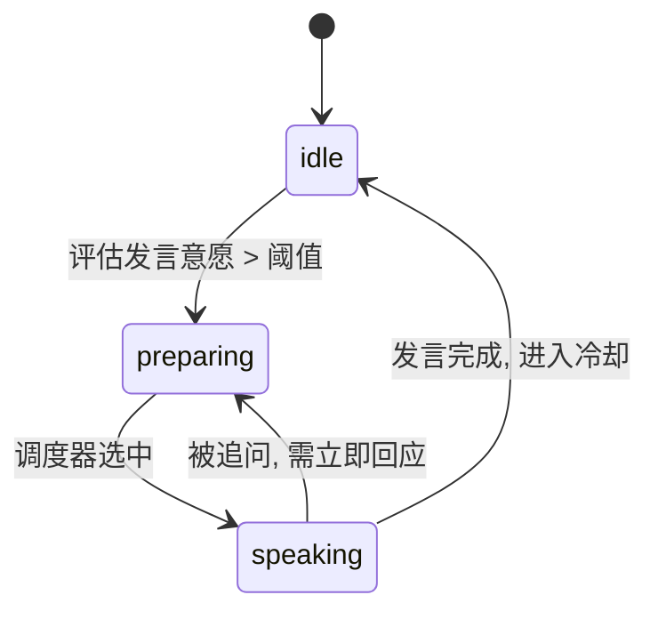

# Smart AI Panel — Superpowers 驱动的开发工作流

> **版本**: v2.0  
> **最后更新**: 2026-06-26  
> **技术栈**: React 18 + Vite + TypeScript / Python FastAPI / SQLite / SSE  
> **LLM**: Deepseek V4 Pro  
> **引擎**: Claude Code + Superpowers 6.0.3  
> **当前状态**: 待确认

---

## 目录

1. [Superpowers 方法论概述](#superpowers-方法论概述)
2. [宏观 A 阶段：Brainstorming — 规格化设计 (SDD)](#宏观-a-阶段brainstorming--规格化设计-sdd)
3. [宏观 B 阶段：Writing Plans — 实施计划 (DDD 桥梁)](#宏观-b-阶段writing-plans--实施计划-ddd-桥梁)
4. [宏观 C 阶段：Subagent-Driven Development — TDD 驱动实现](#宏观-c-阶段subagent-driven-development--tdd-驱动实现)
5. [宏观 D 阶段：E2E — 真实 LLM 对接 & 全链路联调](#宏观-d-阶段e2e--真实-llm-对接--全链路联调)
6. [宏观 E 阶段：Finishing — 交付 & 文档](#宏观-e-阶段finishing--交付--文档)
7. [附录 A: 技术决策记录](#附录-a-技术决策记录)
8. [附录 B: 风险矩阵](#附录-b-风险矩阵)

---

## Superpowers 方法论概述

Superpowers 是一套为编码 Agent 设计的完整软件工程方法论，通过 **可组合的 Skills** 强制执行：

```
Brainstorming  →  Writing Plans  →  Subagent-Driven Dev  →  Finishing
    (SDD)            (DDD桥梁)            (TDD实现)            (交付)
```

### 核心技能矩阵

| Superpowers 技能 | 对应范式 | 在这个项目中的角色 |
|---|---|---|
| `brainstorming` | **SDD** | 产出完整设计规约（API契约 + DB Schema + 状态机 + 算法伪代码） |
| `using-git-worktrees` | 工程基础设施 | 创建隔离工作区，保护主分支 |
| `writing-plans` | **SDD→DDD 桥梁** | 将规约拆解为 bite-sized TDD 任务（每个任务 2-5 分钟） |
| `subagent-driven-development` | **DDD→TDD 执行** | 逐任务派发独立子Agent，两阶段Review（规约合规 + 代码质量） |
| `test-driven-development` | **TDD 铁律** | RED-GREEN-REFACTOR：无失败测试 = 无生产代码 |
| `requesting-code-review` | 质量门禁 | 任务间 + 最终分支级代码审查 |
| `finishing-a-development-branch` | 交付 | 测试验证 → 结构化选项（合并/PR/保留/丢弃） |
| `verification-before-completion` | 验收 | 确保改的东西真的能用 |

### 关键原则

- **YAGNI 无慈悲** — 删掉所有不必要的功能
- **DRY** — 计划层面的复用，不是代码层面的巧合
- **TDD 铁律** — `没有先失败的测试 = 没有生产代码`，违者删除重来
- **独立子Agent** — 每个任务用全新上下文，不受历史污染
- **每任务双Review** — 规约合规性 + 代码质量，两个维度独立判决
- **进度账本** — 写到 `.superpowers/sdd/progress.md`，防压缩丢失

---

## 宏观 A 阶段：Brainstorming — 规格化设计 (SDD)

> **触发技能**: `superpowers:brainstorming`  
> **目标**: 产出覆盖全部 MVP 需求的完整设计规约（Spec）  
> **前置**: 无  
> **产出物**: `docs/superpowers/specs/YYYY-MM-DD-smart-ai-panel-design.md`  
> **硬门禁**: 在 Spec 被用户明确批准之前，**禁止编写任何业务代码**

### A.1 Brainstorming 流程

按 `brainstorming` 技能强制的 9 步流程执行：

```
1. 探索项目上下文 → 2. 逐步提问澄清 → 3. 提出 2-3 种架构方案
→ 4. 逐节呈现设计 → 5. 用户批准 → 6. 写入设计文档
→ 7. Spec 自审 → 8. 用户审查 Spec → 9. 转入 Writing Plans
```

### A.2 设计规约覆盖内容（替代旧版 Phase-1/2/3）

Spec 文件必须覆盖以下全部领域，不得有 TBD：

#### A.2.1 API 接口契约（替代旧 Phase-1）

| 端点 | 方法 | 职责 | Request Body | Response |
|------|------|------|-------------|----------|
| `/api/rooms` | POST | 创建讨论室 | `{topic: str, expert_count: int}` | `{id: uuid, topic, status, created_at}` |
| `/api/rooms` | GET | 讨论列表 | — | `[{id, topic, status, expert_count, created_at}]` |
| `/api/rooms/{id}` | GET | 单个房间详情 | — | `{id, topic, status, experts[], transcript_count}` |
| `/api/rooms/{id}/experts` | POST | 生成专家阵容 | `{}` (可选 user_confirmed) | `{host: Expert, experts: Expert[]}` |
| `/api/rooms/{id}/stream` | GET | SSE 连接 | — | `text/event-stream` |
| `/api/rooms/{id}/start` | POST | 开始讨论 | — | `{stream_started: true}` |
| `/api/rooms/{id}/stop` | POST | 终止讨论 | — | `{stopped: true}` |

#### A.2.2 SSE 事件协议（完整 JSON Schema）

| 事件名 | 方向 | data 字段 | 示例 |
|--------|------|----------|------|
| `room.status` | S→C | `{room_id, status, timestamp}` | `{"room_id":"r1","status":"discussing","timestamp":1719000000}` |
| `expert.state` | S→C | `{expert_id, name, status, public_thought, timestamp}` | `{"expert_id":"e2","name":"张教授","status":"speaking","public_thought":"我认为需要考虑技术可行性..."}` |
| `transcript.line` | S→C | `{expert_id, name, title, color, content, line_type, sequence_num, timestamp}` | `{...,"line_type":"rebuttal","content":"我不同意，因为..."}` |
| `insight.update` | S→C | `{consensus: [{id, content}], disagreement: [{id, content}], timestamp}` | 共识和分歧增量更新 |
| `discussion.end` | S→C | `{summary, total_rounds, final_consensus, final_disagreement}` | 主持人总结 |
| `heartbeat` | S→C | `{timestamp}` | 每 15 秒 |
| `error` | S→C | `{code, message, recoverable}` | `{"code":"LLM_TIMEOUT","message":"...","recoverable":true}` |

#### A.2.3 数据库 ER 图 & DDL（替代旧 Phase-2）

**实体关系**:
```
Room (1) ──── (N) Expert
Room (1) ──── (N) TranscriptLine
Room (1) ──── (N) Insight
Room (1) ──── (N) DiscussionEvent (内部调度日志)
```

**表结构** (`database/schema.sql`):
- `rooms`: `id TEXT PK, topic TEXT, expert_count INT, status TEXT, created_at TEXT, updated_at TEXT`
- `experts`: `id TEXT PK, room_id TEXT FK, name TEXT, title TEXT, stance TEXT, color TEXT, role TEXT, position INT`
- `transcript_lines`: `id TEXT PK, room_id TEXT FK, expert_id TEXT FK, content TEXT, line_type TEXT, sequence_num INT, created_at TEXT`
- `insights`: `id TEXT PK, room_id TEXT FK, type TEXT, content TEXT, version INT, updated_at TEXT`
- `discussion_events`: `id TEXT PK, room_id TEXT FK, event_type TEXT, payload JSON, created_at TEXT`

#### A.2.4 调度算法 & Agent 行为状态机（替代旧 Phase-3）

**专家状态机**:


**调度评分函数（伪代码）**:
```
score(expert, context, last_transcript) = 
    w1 × relevance(expert.stance, last_transcript.content)    // 立场相关度
  + w2 × contrarian_bias(expert, last_transcript.speaker)      // 反驳意愿
  - w3 × cooldown_penalty(expert.last_speak_time)              // 冷却惩罚
  + w4 × random_noise()                                        // 随机扰动

cooldown_penalty(t) = max(0, COOLDOWN_THRESHOLD - turns_since(t))

选择: top_score > SPEAK_THRESHOLD → 发言; else → 主持人追问
```

**讨论生命周期**:
```
waiting → generating → ready → discussing → finished
                                ↓
                            stopped (用户手动终止)
```

**终止条件**:
1. 达到最大轮次 (`MAX_ROUNDS = 12`)
2. 连续 2 轮无新观点产生
3. 用户手动终止

### A.3 A 阶段验收标准

- [ ] Spec 文件覆盖以上全部领域，无 TBD/TODO
- [ ] Spec 通过自审（占位符扫描 + 一致性检查 + 范围检查 + 歧义检查）
- [ ] 用户已审查并通过 Spec
- [ ] Spec 已 commit 到 git

---

## 宏观 B 阶段：Writing Plans — 实施计划 (DDD 桥梁)

> **触发技能**: `superpowers:writing-plans` → `superpowers:using-git-worktrees`  
> **目标**: 将 Spec 拆解为 bite-sized TDD 任务，每个任务含完整代码和测试  
> **前置**: A 阶段 Spec 已批准  
> **产出物**: `docs/superpowers/plans/YYYY-MM-DD-smart-ai-panel-plan.md`

### B.1 工作区隔离

在开始写 Plan 之前，先执行 `using-git-worktrees`:
1. 检测是否已在隔离工作区
2. 若否，使用 `EnterWorktree` 创建
3. 执行项目依赖安装
4. 验证空白测试基线（此时无测试=基线干净）

### B.2 计划文档结构

```markdown
# Smart AI Panel 实施计划

> **For agentic workers:** REQUIRED SUB-SKILL: Use superpowers:subagent-driven-development

**Goal:** 构建 AI 圆桌讨论 MVP（React + FastAPI + SQLite + SSE）

**Architecture:** 前后端分离，SSE 实时推送，Mock LLM 先行，最后接入 Deepseek

**Tech Stack:** React 18/Vite/TypeScript, Python FastAPI, aiosqlite, SSE

## Global Constraints
[TODO: 从 Spec 中提取全部跨任务的硬性约束]

---
### Task 1: 项目骨架与配置
### Task 2: 数据库 Schema 与迁移
### Task 3: Room CRUD API
...
```

### B.3 任务分解原则

遵循 `writing-plans` 的严格规则：
- 每个任务**2-5 分钟**可完成（一个 RED-GREEN-REFACTOR 循环）
- 每个 Step 含**完整代码**，不写"类似 Task N"
- **精确文件路径**、**精确命令**、**预期输出**
- 严禁 TBD、TODO、vague 描述

### B.4 任务分组（预期）

| 组 | 任务范围 | 依赖 | 
|----|---------|------|
| **Foundation** | Task 1-3: 项目骨架、DB Schema、配置管理 | — |
| **Backend Core** | Task 4-10: Room API、Expert API、Mock LLM、SSE Manager | Foundation |
| **Frontend Core** | Task 11-18: 路由、状态管理、首页、Lobby、演播厅布局 | Backend Core (API 可用) |
| **Scheduler (TDD)** | Task 19-30: 严格 TDD 的调度器 + 洞察提炼器 | Backend Core |
| **Integration** | Task 31-35: API 集成测试、SSE 事件完整流测试 | Scheduler |
| **Polish** | Task 36-40: 响应式适配、动画、错误状态、加载态 | Frontend Core |

### B.5 B 阶段验收标准

- [ ] Plan 文件包含全部任务，每个任务含完整代码
- [ ] Plan 通过自审（规约覆盖 + 占位符扫描 + 类型一致性）
- [ ] Plan 不含 TBD、TODO、"similar to Task N"
- [ ] 用户已审查并通过 Plan
- [ ] Plan 已 commit

---

## 宏观 C 阶段：Subagent-Driven Development — TDD 驱动实现

> **触发技能**: `superpowers:subagent-driven-development`  
> **目标**: 按 Plan 逐任务执行，每个任务经历完整的 TDD + 双Review  
> **前置**: B 阶段 Plan 已批准，工作区已隔离  
> **核心**: 严格 TDD — RED → GREEN → REFACTOR，违反者代码删除重来

### C.1 执行流程

```
┌─────────────────────────────────────────────────┐
│              C 阶段：逐任务循环                    │
│                                                   │
│  1. 读取 Plan，提取 Task N                        │
│  2. 派发 Implementer 子Agent（全新上下文）          │
│     ├─ RED: 先写测试 → 验证失败                     │
│     ├─ GREEN: 最小实现 → 验证通过                   │
│     ├─ REFACTOR: 清理 → 验证仍通过                  │
│     ├─ Self-review → Commit                      │
│     └─ 写入 Report 文件                            │
│  3. 派发 Task Reviewer 子Agent                     │
│     ├─ 规约合规检查 ✅/❌                             │
│     └─ 代码质量审查 ✅/❌                             │
│  4. 若有 Critical/Important 问题:                   │
│     └─ 派发 Fixer → 重新 Review（循环至通过）        │
│  5. 标记 Task N 完成，追加进度账本                   │
│  6. 循环至 Task N+1                                │
│  7. 全部完成后: 派发 Final Branch Reviewer          │
└─────────────────────────────────────────────────┘
```

### C.2 TDD 铁律（`test-driven-development` 技能强制执行）

```
铁律: 没有先失败的测试 = 没有生产代码
─────────────────────────────────────────
- 代码写在测试之前？→ 删除，重新开始
- 测试第一次就通过？→ 测试写错了，修测试
- "这个太简单不需要测试" → 归为借口
- "测试之后写也一样" → 不一样。测试之后写 = 验证实现；测试之前写 = 验证需求
```

### C.3 任务 Review 门禁

每个任务必须通过两个维度的审查：

| 维度 | 审查内容 | 不通过的后果 |
|------|---------|------------|
| **规约合规** | 是否实现了 Plan 中的全部要求？是否多做了 Plan 中没有的东西？ | 打回重做 |
| **代码质量** | 命名、DRY、错误处理、边界条件 | Critical/Important → 修；Minor → 记录，最终 Review 时处理 |

### C.4 C 阶段范围（覆盖旧 Phase-4/5/6/7）

C 阶段一次性完成所有代码实现，包括：

**后端 (旧 Phase-4):**
- FastAPI 架构 + SQLite DAL
- 全部 REST API 端点
- Mock LLM 服务（与真实 LLM 同接口签名）
- SSE Manager（多房间隔离）
- Mock 调度器 + 洞察提炼器

**前端 (旧 Phase-5):**
- React 路由 + Zustand 状态管理
- 首页（讨论列表 + 新建入口）
- Lobby（阵容确认页）
- 演播厅（Transcript + Expert Cards + Insight Panel）
- SSE 客户端 Hooks + API 客户端层
- 响应式布局 + 加载/空/错误状态

**真实调度器 (旧 Phase-6, TDD 先行):**
- 严格按 TDD 编写 10+ 个调度器单元测试
- 实现 Scheduler → 通过全部测试
- 实现 InsightExtractor → 通过全部测试

**集成测试 (旧 Phase-7):**
- 10+ 个 API 集成测试
- SSE 完整事件流测试
- 多房间隔离测试

### C.5 C 阶段验收标准

- [ ] 所有 Plan 任务标记完成
- [ ] 每个任务都有通过的 Review（规约 ✅ + 质量 ✅）
- [ ] `pytest tests/ -v` → 全部 PASS（包括单元测试 + 集成测试）
- [ ] `npm test`（前端）→ 全部 PASS
- [ ] 手动走通：创建 → 阵容生成 → Mock 讨论 → 结束（全流程）
- [ ] 3 个房间同时运行 SSE，事件不串扰
- [ ] 前端各区域独立滚动，无全局滚动条
- [ ] 最终 Branch Reviewer 通过

---

## 宏观 D 阶段：E2E — 真实 LLM 对接 & 全链路联调

> **目标**: 将 Mock LLM 替换为 Deepseek V4 Pro，完成 Prompt 调优与全链路验证  
> **前置**: C 阶段全部通过  
> **原则**: 切换只需改一个环境变量 `LLM_MODE=real`

### D.1 任务清单

| # | 任务 | 说明 |
|---|------|------|
| D.1 | Deepseek API 客户端 | `openai` SDK（兼容 Deepseek endpoint），支持 streaming |
| D.2 | Prompt 模板 — 阵容生成 | System + User prompt，输出结构化 JSON（host + experts[]） |
| D.3 | Prompt 模板 — 专家发言 | 立场注入 + 上下文窗口 + 发言长度硬限制 |
| D.4 | Prompt 模板 — 主持人 | 开场白 / 追问 / 总结陈词 三种模式 |
| D.5 | Prompt 模板 — 共识提炼 | 从 Transcript 提取共识和分歧 |
| D.6 | 流式适配 | Deepseek streaming → SSE token-by-token 推送 |
| D.7 | 超时 & 重试 | 30s 超时，最多 2 次重试，指数退避 |
| D.8 | 输出安全过滤 | 过滤 JSON 裸数据、隐藏思维链标签、Markdown 代码块 |
| D.9 | 联调测试 | 至少 3 个不同话题的完整讨论，人工评估质量 |
| D.10 | Prompt 精调 | 基于联调反馈迭代，确保：发言精炼、立场鲜明、无数据泄露 |

### D.2 D 阶段验收标准

- [ ] `LLM_MODE=real` 环境下完整走通创建→阵容→讨论→结束
- [ ] 4 专家场景讨论 ≥ 6 轮
- [ ] 前端页面零 JSON 裸渲染、零思维链泄露
- [ ] 共识/分歧在讨论过程中持续动态更新
- [ ] 专家立场差异可被人类明确感知

---

## 宏观 E 阶段：Finishing — 交付 & 文档

> **触发技能**: `superpowers:finishing-a-development-branch`  
> **前置**: D 阶段完成 + 全部测试通过  
> **过程**: 验证 → 检测环境 → 呈现结构化选项 → 执行 → 清理

### E.1 Finishing 流程

```
Step 1: 验证全部测试 → Step 2: 检测环境
→ Step 3: 确定 Base Branch
→ Step 4: 呈现 4 选项（合并本地 / 创建 PR / 保留 / 丢弃）
→ Step 5: 执行用户选择
→ Step 6: 清理工作区
```

### E.2 交付物清单

| # | 交付物 | 内容 |
|---|--------|------|
| E.1 | 用户手册 | 安装、配置 `.env`、启动前后端、使用各功能 |
| E.2 | 技术架构图 | Mermaid 组件图 + 数据流图 |
| E.3 | API 文档 | 从 FastAPI Swagger 导出或直接使用 `/docs` |
| E.4 | Roadmap | 后续改进方向（Agent 记忆、TTS、打断机制） |
| E.5 | 代码清理 | 删除 dead code、console.log、debug 注释 |

---

## 附录 A: 技术决策记录

### A.1 已决策

| 决策点 | 选择 | 理由 |
|--------|------|------|
| 前端框架 | React 18 + Vite + TypeScript | 用户指定 |
| 后端框架 | Python FastAPI + uvicorn | 用户指定 |
| 数据库 | SQLite (aiosqlite) | 硬性要求 + 轻量无外部依赖 |
| 实时通信 | SSE (Server-Sent Events) | 单向推送足够，比 WebSocket 更简单 |
| LLM | Deepseek V4 Pro API | 用户提供 Key |
| 开发范式 | SDD → DDD → TDD | 用户要求 |
| 工程引擎 | Claude Code + Superpowers 6.0.3 | 用户要求 |

### A.2 待决策（Design 阶段确认）

| 决策点 | 候选 | 建议 |
|--------|------|------|
| CSS 方案 | Tailwind CSS / CSS Modules / styled-components | Tailwind（快速、响应式友好） |
| 组件库 | shadcn/ui / Ant Design / 纯手写 | shadcn/ui（Radix 无样式 + 可定制） |
| 状态管理 | Zustand / Jotai / Context | Zustand（轻量、TS 友好、够用） |
| 数据访问 | aiosqlite 原生 / SQLAlchemy async | aiosqlite 原生（表简单，无 ORM 开销） |

### A.3 Spec 产出物路径

| 文件 | 内容 | 阶段 |
|------|------|------|
| `docs/superpowers/specs/YYYY-MM-DD-smart-ai-panel-design.md` | 完整设计规约 | A |
| `docs/superpowers/plans/YYYY-MM-DD-smart-ai-panel-plan.md` | Bite-sized 实施计划 | B |
| `.superpowers/sdd/progress.md` | 进度账本（逐任务更新） | C |
| `database/schema.sql` | DDL（在 Plan 的某个 Task 中产出） | C |

---

## 附录 B: 风险矩阵

| 风险 | 概率 | 影响 | 缓解措施 |
|------|------|------|---------|
| LLM Prompt 不可控（JSON 泄露、发言过长、立场偏离） | 高 | 高 | Prompt 严格约束 + 输出后处理 filter + D.8 安全过滤 |
| SSE 连接断开 | 中 | 中 | 15s 心跳 + 客户端自动重连 + EventSource 原生重连 |
| 多房间资源竞争 | 低 | 中 | SQLite WAL 模式 + 房间级 SSE channel 隔离 |
| 调度器死锁（所有专家都不举手） | 中 | 高 | 超时强制主持人追问 + 最低发言间隔后随机强制选择 |
| LLM API 超时 | 中 | 中 | 30s 超时 + 2 次重试 + 指数退避 |
| 上下文窗口溢出 | 中 | 中 | 滑动窗口裁剪 + 旧 Transcript 摘要压缩 |

---

> ## 🚦 阶段门禁规则
>
> - **A → B**: Spec 完成 + 用户批准 + commit
> - **B → C**: Plan 完成 + 用户批准 + commit + 工作区已隔离
> - **C 内部**: 每个 Task 必须通过双 Review 后才算完成
> - **C → D**: 全部测试绿灯 + Final Branch Review 通过
> - **D → E**: 真实 LLM 联调通过 + 人工验收通过
>
> **每个宏观阶段开始前**：需要你的明确口头确认  
> **C 阶段执行中**：连续执行，不在任务间暂停（除非 BLOCKED）  
> **遇阻时**：立即暂停并请求你的决策

---

**请确认以上 Revised Workflow 是否满足你的预期。确认后，我将等待你的"A 阶段"指令，启动 `superpowers:brainstorming` 流程。**
